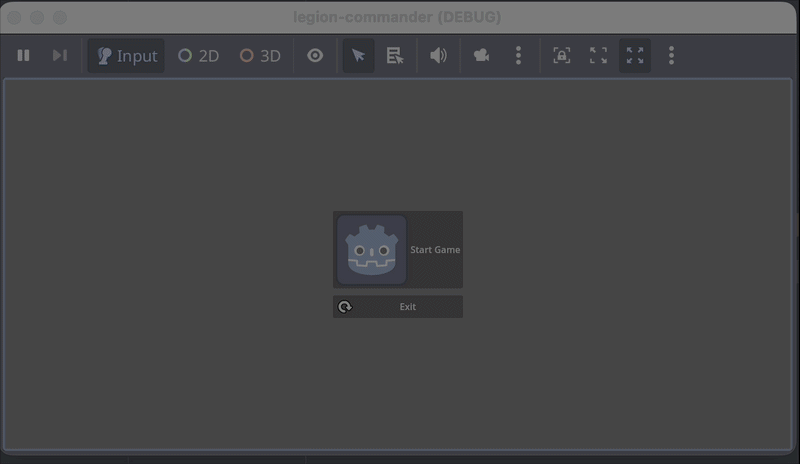

# Legion Commander

A top-down Godot game inspired by **Pikmin** and **Patapon**. Pluck Roman legionaries out of your ranks, hurl them across a 200-metre battlefield, and grind rival legions into the dirt.

## Features

- **Pikmin-style squad control** — pick up a soldier, aim with the mouse, throw him onto a flank. Blow the horn to gather everyone back in.
- **Four unit roles** — Legionary (shield/gladius), Hastatus (spear reach), Sagittarius (arrows), Veles (fast skirmisher). Each has its own stats, colour and behaviour.
- **Mass combat** — units auto-engage, hold ground, block, get knocked back, and swarm whoever kills their neighbours.
- **Rival legions with officers** — enemy captains command real squads, hold territory, buff nearby troops, and order advances or retreats based on casualties. Kill the captain and the squad loses its nerve.
- **Procedural battlefield** — a ~200 m map of six regions (home camp, forest, ruined forum, open plain, rocky highland, marsh) with terrain, forests, boulders, ruins and a generated navigation mesh.
- **Recruit pods** — shield stacks scattered across the map release unaligned legionaries. Whistle them into your legion.
- **Camps as objectives** — outposts, warbands, rival legions and a stronghold. Wipe the garrison to take the banner.

## Controls

| Input | Action |
| --- | --- |
| `WASD` | Move the commander |
| `Left Mouse` | Pick up the front legionary and throw him at the cursor |
| `Right Mouse` (hold) | Whistle — an expanding ring gathers loose units and stragglers |
| `Tab` | Cycle which role the next throw pulls |
| `Space` | Charge — send the whole squad at the cursor |
| `X` | Dismiss — the squad holds its current ground |
| `Q` / `E` | Orbit camera |
| `Arrow keys` | Pan camera |
| `Mouse wheel` | Zoom |
| `Middle drag` | Free-look orbit |

## Architecture

```
scripts/combat/
  combat_types.gd     factions, roles, stat blocks, collision layers
  combatant.gd        base class: health, damage, blocking, knockback, death, animation
  battle_service.gd   autoload `Battle` - spatial hash for "who is near me?", scoreboard
  projectile.gd       arrows, built in code
  floating_text.gd    damage numbers and callouts
scripts/world/
  world_generator.gd  terrain mesh, biome tinting, prop scatter, navmesh
  legion_pod.gd       recruit pods
scripts/commander/
  command_gizmos.gd   throw arc, landing reticle, whistle ring
scripts/battle_manager.gd   level root: assembles world, camps, pods, input
```

The spatial hash matters: with 150 soldiers on the field, every unit calling `get_nodes_in_group()` each frame is what kills the framerate. Units register once with `Battle` and report only when they cross a cell boundary, so target acquisition is a handful of dictionary lookups. Perception scans are also staggered per unit so they never all think on the same frame.

The navigation mesh is generated directly from the walkability grid (blocked cells + slope test) and greedily merged into rectangles, rather than baked from collision geometry — much faster and more predictable at this map size.

## Getting Started

1. Clone this repository.
2. Open with [Godot Engine](https://godotengine.org/) 4.4+.
3. Run the project and pick **Campaign — The Great Field**.

The original hand-built arena is still there under **Skirmish — Old Arena**.

## Media

[](media/screen_capture.gif)

## Credits

- Inspired by Pikmin & Patapon
- Character and weapon models: Quaternius / Kenney asset packs

## License

MIT License
